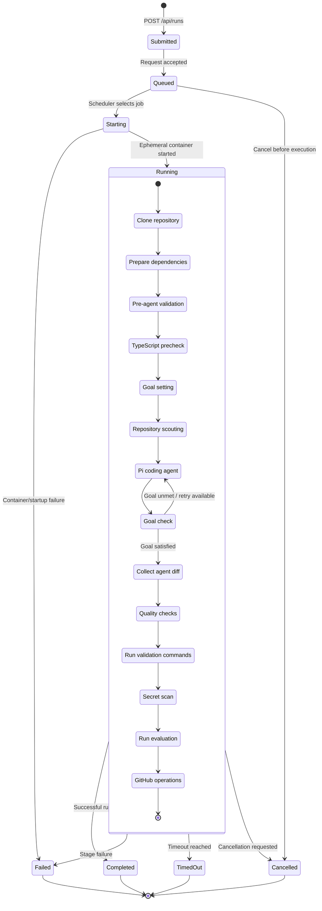
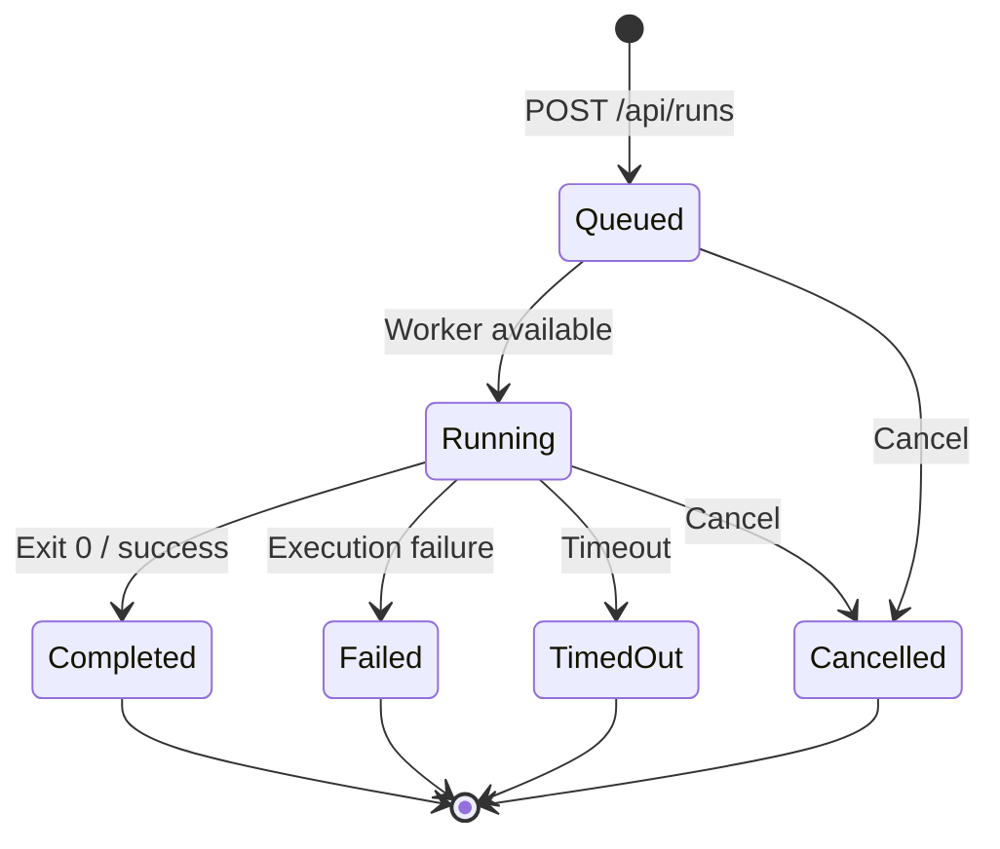
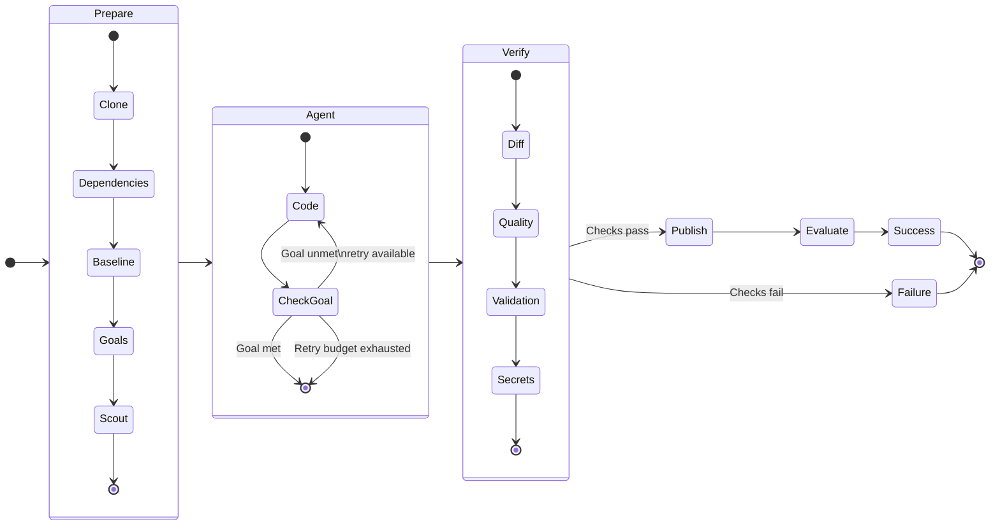
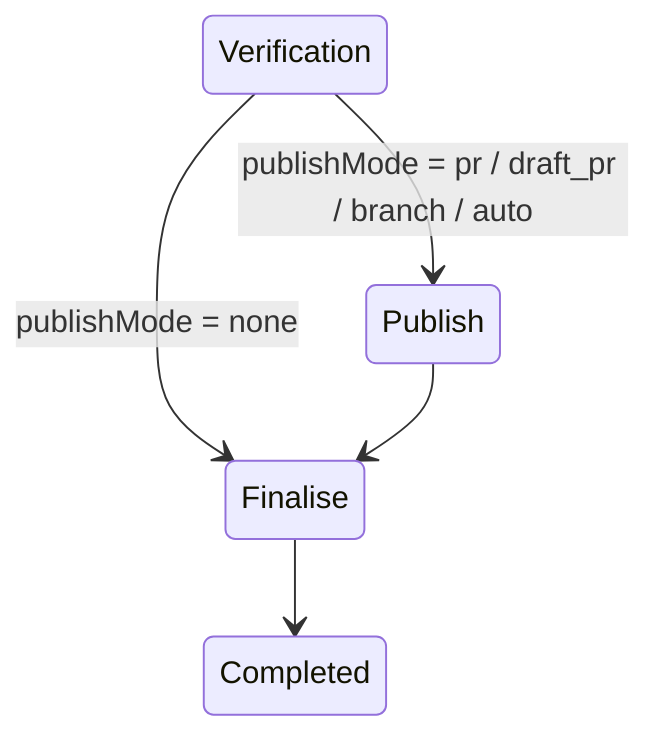
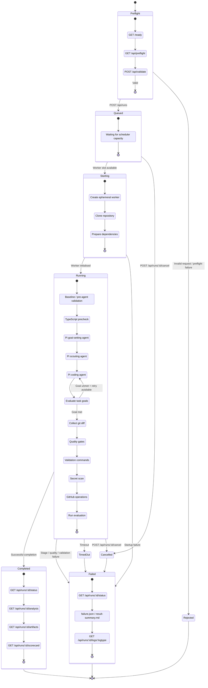
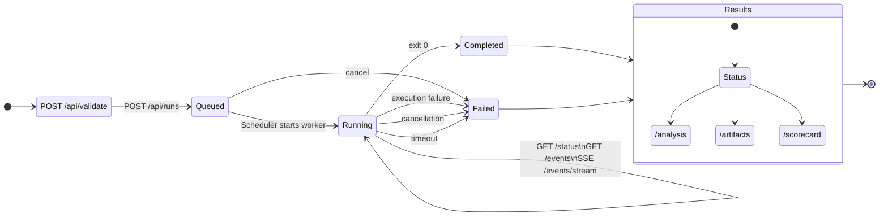
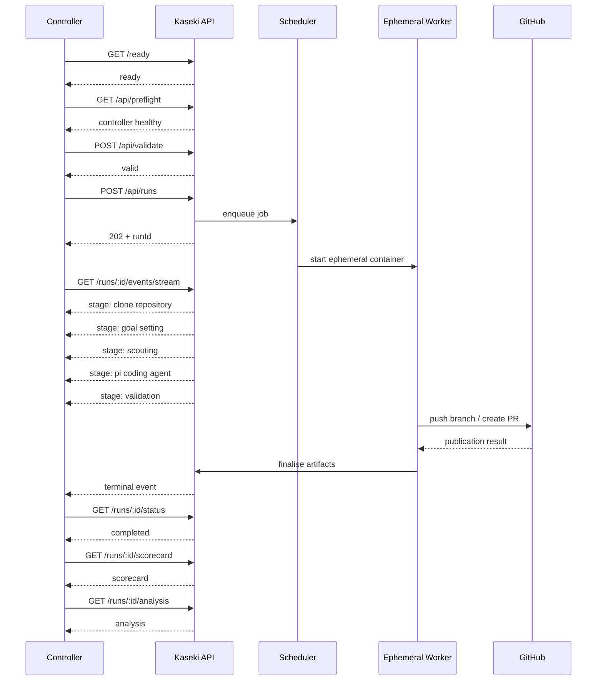

# Flows of kaseki-agent workflows

Three conceptual levels:

1. **Run lifecycle** — what an API consumer cares about.
2. **Worker execution** — what happens inside `Running`.
3. **Goal/retry loop** — the interesting agent-specific behaviour.

## A typical patch-mode Kaseki run

A **typical patch-mode Kaseki run** looks like:



There is one qualification I’d make to this diagram: **this is a conceptual run-state diagram rather than a literal transcription of every internal progress event**. The repository's stage-derivation code contains some implementation-specific ordering used for progress/status calculation, while the architecture documentation describes the broader flow as repository preparation → Pi execution → validation/quality gates → result artifacts. ([GitHub][1])

## More specific flows

### High-level lifecycle

The high-level lifecycle can be much simpler:



This corresponds closely to Kaseki's API model. Runs are submitted asynchronously through `POST /api/runs`, while the API provides status/progress, logs and result retrieval around that lifecycle. The current implementation distinguishes lifecycle outcomes including queued, running, completed, failed, cancelled and timed-out states in its run/scorecard model.

### The Agent Loop: The more interesting Kaseki-specific diagram

I think the **agent loop** is what makes the diagram useful rather than just looking like any ordinary job queue:



I prefer this version for **Kaseki's README/architecture documentation**, because it makes clear that Kaseki isn't simply:

`LLM → code → PR`

but rather:

**prepare → understand → act → evaluate → verify → publish**

That matches the repository's emphasis on isolated workspaces, goal setting/scouting, Pi execution, validation and quality gates, result artifacts, and GitHub publication. ([GitHub][1])

One thing I would make explicit is that **publishing is conditional**. Kaseki supports modes such as normal PR, draft PR, branch-only, automatic publishing and no publishing; therefore `Verify → Publish` should really have a bypass:



The API describes publishing as occurring after validation, with the controller's normal patch-run default being a PR.

### Recommended primary diagram



There is a subtle point here: **`Cancelled` and `TimedOut` are useful conceptual states, but at the controller/job API level they can surface as `failed` with a `failureClass` such as `cancelled` or `timeout`.** I would retain them in the architecture diagram because they are genuinely distinct outcomes, but show that they collapse into the failed terminal path from the client's perspective.

## Overlaying the API onto the lifecycle

I’d describe the API surface like this:

| Lifecycle  | Primary endpoint                  | Purpose                                       |
| ---------- | --------------------------------- | --------------------------------------------- |
| Before run | `GET /ready`                      | Can the service accept work?                  |
| Before run | `GET /api/preflight`              | Is Docker/image/GitHub configuration healthy? |
| Before run | `POST /api/validate`              | Is this particular run request valid?         |
| Submit     | `POST /api/runs`                  | Create asynchronous run                       |
| Any        | `GET /api/runs`                   | Discover/list runs                            |
| Queued     | `GET /api/runs/:id/status`        | Queue/run state                               |
| Queued     | `POST /api/runs/:id/cancel`       | Remove queued job                             |
| Running    | `GET /api/runs/:id/status`        | Current stage, elapsed time, timeout risk     |
| Running    | `GET /api/runs/:id/progress`      | Sanitised progress history                    |
| Running    | `GET /api/runs/:id/events`        | Controller-friendly event stream snapshot     |
| Running    | `GET /api/runs/:id/events/stream` | Live SSE updates                              |
| Running    | `GET /api/runs/:id/logs/:logtype` | Inspect detailed logs                         |
| Running    | `POST /api/runs/:id/cancel`       | Stop execution                                |
| Terminal   | `GET /api/runs/:id/status`        | Final result and inline diagnostics           |
| Terminal   | `GET /api/runs/:id/analysis`      | Consolidated run analysis                     |
| Terminal   | `GET /api/runs/:id/artifacts`     | Discover generated artifacts                  |
| Terminal   | `GET /api/results/:id/:file`      | Retrieve individual artifact                  |
| Terminal   | `GET /api/runs/:id/scorecard`     | Canonical scored assessment                   |

The particularly useful addition since your earlier Kaseki architecture is the **event interface**. I would encourage a controller to use:

```text
POST /api/runs
       │
       ▼
run id
       │
       ├── GET /status
       │
       └── GET /events/stream
                 │
                 ▼
          stage transitions
                 │
        ┌────────┴─────────┐
        ▼                  ▼
    completed           failed
        │                  │
        ▼                  ▼
    scorecard          diagnostics
    analysis           artifacts
```

That is a cleaner integration model than having a controller repeatedly scrape logs.

### Separate API lifecycle diagram

For API documentation I would include this smaller diagram as well:



## And a controller interaction diagram

Strictly speaking this isn't a state diagram, but I think it belongs beside it because it answers a different and very practical question: **who owns each transition?**



### One change I would make to the conceptual Kaseki model

Looking at the current code, I would no longer describe the high-level run simply as:

> prepare → understand → act → evaluate → verify → publish

I think Kaseki has evolved enough that the cleaner vocabulary is:

**admit → prepare → orient → execute → verify → publish → assess**

where:

```text
ADMIT
  ready
  preflight
  validate request
  queue

PREPARE
  create container
  clone
  dependencies
  baseline validation

ORIENT
  goal setting
  scouting
  allowlist derivation

EXECUTE
  Pi coding agent
  goal-check/retry loop

VERIFY
  diff
  quality gates
  validation
  secret scan

PUBLISH
  branch / PR / draft PR
  or skip when publishMode=none

ASSESS
  run evaluation
  scorecard
  result artifacts
```

That seven-stage model feels particularly strong for Kaseki because it separates **whether a task is safe/valid to run**, **understanding the task**, **doing the task**, and **judging what happened**.
